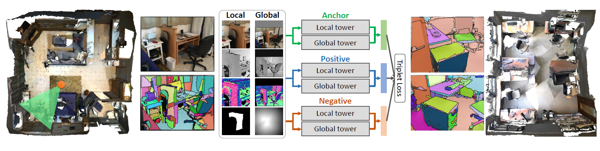

# PlaneMatch

This is the code repository for ["PlaneMatch: Patch Coplanarity Prediction for Robust RGB-D Reconstruction"][1] .

European Conference on Computer Vision 2018 (Oral presentation)

Created by Yifei Shi, Kai Xu, Matthias Niessner, Szymon Rusinkiewicz and Thomas Funkhouser



## Data download
You can download the data [here][2]

## Pretrained network download
You can download our network model trained on 10 million triplets [here][3]

## Usage - Coplanarity Network
### Dependancy
The code depends on Pytorch. Both Python 2.x and 3.x should work.

### Training
To train a model from scratch, run:
~~~~ 
python train.py --train_root_dir TRAINING_TRIPLETS_DIR
~~~~ 

Arguments:
```
'--epochs' (number of epochs; default=100)
'--batch_size' (batch size; default=16)
'--num_workers' (number of workers; default=8)
'--save_snapshot' (save snapshots of trained model)
'--save_snapshot_every' (save training log for every X frames; default=100)
'--lr' (initial learning rate; default=.001)
'--focal_loss_lambda' (the lambda in the focal loss; default=3)
'--gpu' (device id of GPU to run cuda; default=0)
'--train_csv_path' (the path of triplet_train.csv)
'--train_root_dir' (the folder path of training_triplets)
'--save_path' (trained model path, default='./models')
```

### Testing
To extract feature for COP, run:
~~~~ 
python test.py --test_root_dir COP_DIR
~~~~ 
For example, if you want to extract feature for the positive data in COP-D1, use command:
~~~~ 
python test.py --test_root_dir COP/COP-D1_pos
~~~~ 

Arguments:
```
'--test_csv_path' (the path of triplet_test.csv)
'--test_root_dir' (the folder path of testing data)
'--feature_path' (feature extraction output path, default='./feature_extraction')
```

## Citation
If you find PlaneMatch useful in your research, please cite:
~~~~
@inproceedings{shi2018planematch,
 author = {Yifei Shi and Kai Xu and Matthias Nie{\ss}ner and Szymon Rusinkiewicz and Thomas Funkhouser},
 booktitle = {Proceedings of the European Conference on Computer Vision ({ECCV})},
 title = {PlaneMatch: Patch Coplanarity Prediction for Robust RGB-D Reconstruction},
 year = {2018}
}
~~~~

[1]:  http://www.yifeishi.net/files/shi_eccv18_planematch.pdf "PlaneMatch: Patch Coplanarity Prediction for Robust RGB-D Reconstruction"
[2]:  https://docs.google.com/forms/d/e/1FAIpQLSeldrhc2aWUKdqpDDNPZksGGkdlYACtpyTl2C6hw5u23_KxjQ/viewform?usp=sf_link "Data"
[3]:  https://www.dropbox.com/s/gbqlrivf32lbl8r/model.pkl?dl=0 "Pretrained network"

